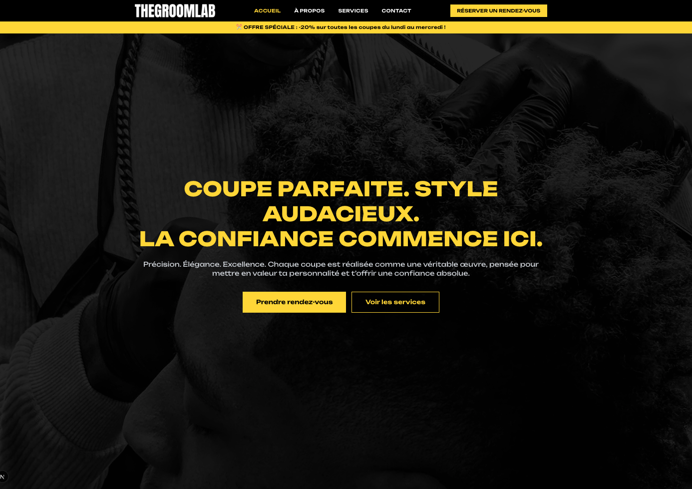
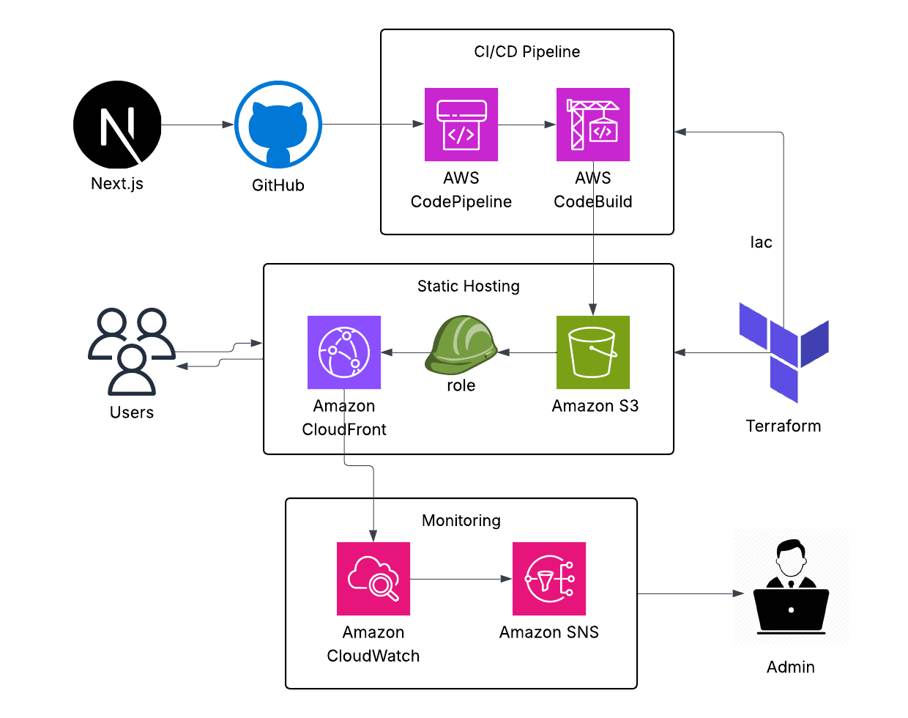

# 💈 THE GROOM LAB  
### **Prenez rendez-vous. Révélez votre style.**

---

Application vitrine moderne pour barber haut de gamme :  
✅ Présentation des prestations  
✅ Prise de rendez-vous en ligne  
✅ Site accessible & responsive  
✅ Déploiement automatique via Terraform (S3 + CloudFront)

---

### 🏗️ Architecture (diagramme)

## 🎯 Objectif

Créer une expérience premium permettant aux visiteurs de :

- Découvrir les **prestations de coupe** (barbe, cheveux, soins).
- Prendre un **rendez-vous instantanément** via un CTA clair.
- Naviguer facilement, même avec des limitations visuelles ou motrices.

> 🧠 *Le design n'est pas seulement beau. Il est pensé pour **convertir**.*

---

## ✨ Fonctionnalités clés (orientées utilisateur)

### 💇‍♂️ Prestations & services
- Présentation des prestations avec description et tarifs
- Pages dédiées (coupe / barbe / soin)
- Mise en valeur de l'expertise

### 📅 Prise de rendez-vous
- CTA visible dès l’arrivée (“Prendre rendez-vous”)
- Call-to-action répétés dans le parcours utilisateur

### ♿ Accessibilité & UX (AA / AAA)
- Contraste fort (jaune / noir )
- Navigation au clavier
- Texte lisible, boutons bien espacés
- Labels accessibles (`aria-label`, `role="button"`)

---

## 🚀 Stack & architecture

| Technologie      | Usage |
|------------------|--------|
| **Next.js 16.0.1 (static export)** | Front-end + génération statique |
| **React**        | UI Components |
| **Terraform**    | Infra (S3 + CloudFront + ACM + OAC) |
| **GitHub Actions** | CI/CD : build + upload + invalidation cache |
| **AWS S3**       | Hébergement du site |
| **AWS CloudFront** | CDN global + HTTPS |

